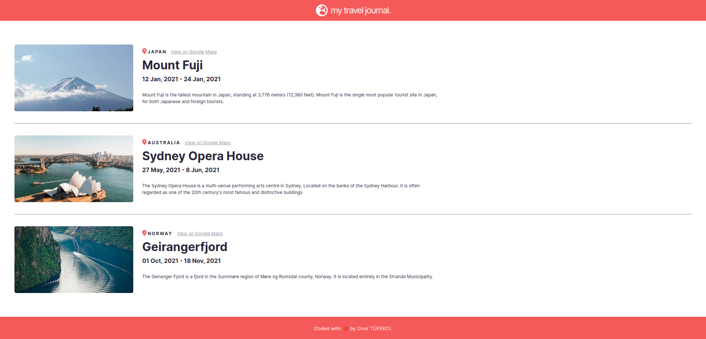

# My Travel Journal - React App

## Description

My Travel Journal is a simple React app that displays a list of travel destinations along with their information and images. The app allows users to view details about each location, including the start and end dates of the trip, a brief description, and a link to view the location on Google Maps.

## Table of Contents

- [Installation](#installation)
- [Technologies](#technologies)
- [License](#license)

## Installation

To run the app locally, follow these steps:

1. Clone the repository to your local machine.
2. Navigate to the project directory using the terminal.
3. Install the necessary dependencies by running:

## Technologies
The app is built using the following technologies:

- React: A JavaScript library for building user interfaces.
- FontAwesome: A popular icon library used for displaying location and Earth icons.

## License
This project is licensed under the MIT License.